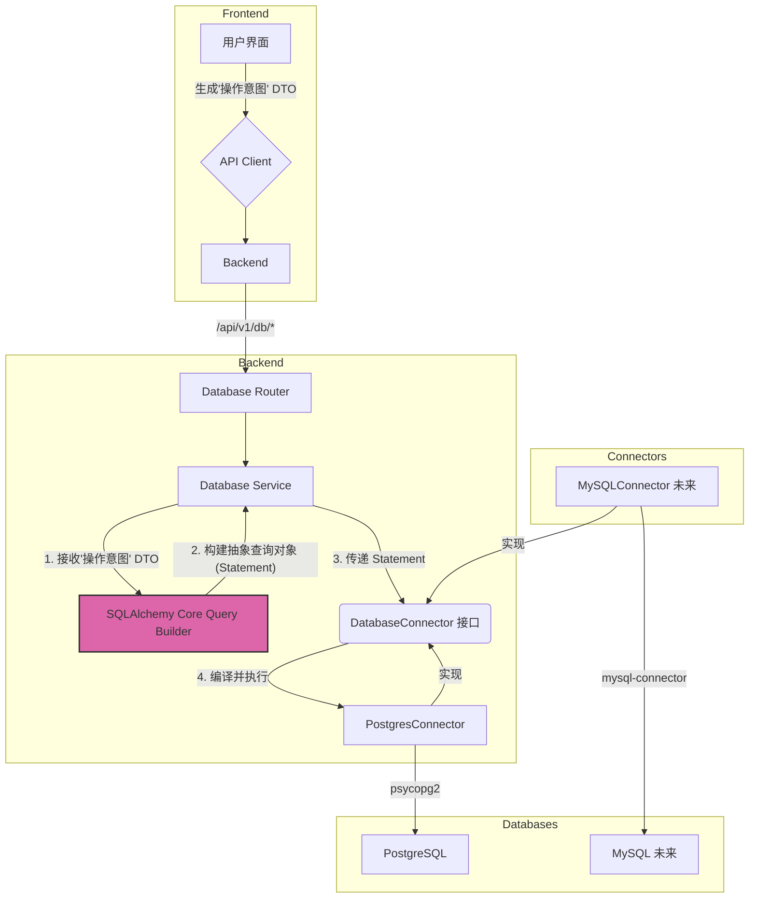

### RFC-001: 数据库连接与统一数据访问层设计

#### 1. 为什么这么做 (The "Why")

我们的目标是构建一个能连接多种数据源（PostgreSQL, MySQL, SQL Server,甚至将来的 NoSQL 等）的多维表格系统。如果直接在业务逻辑中编写针对 PostgreSQL 的连接和查询代码，会导致以下问题：

*   **高耦合**: 业务逻辑与特定数据库驱动（如 `psycopg2`）深度绑定，未来更换或增加数据库类型将是灾难性的，需要重写大量代码。
*   **可维护性差**: 每种数据库的 SQL 方言、连接参数、错误处理方式都略有不同。将这些差异散布在各个业务模块中，会使代码变得混乱且难以维护。
*   **扩展性弱**: 无法平滑地接入新的数据源。

因此，我们必须在后端设计一个**统一数据访问层 (Unified Data Access Layer)**。该层将定义一个标准的数据库操作接口，而业务逻辑层只与这个标准接口交互，完全无需关心底层连接的是哪种数据库。这是一种典型的**策略模式 (Strategy Pattern)** 或 **适配器模式 (Adapter Pattern)** 的应用，是构建可扩展系统的基石。

#### 2. 如何实现 (The "How")

我们将分后端和前端两部分进行规划，核心在于后端的抽象设计。

##### **后端 (Backend) 改造计划**

1.  **定义统一连接器接口 (Define Connector Interface)**:
    在 `packages/backend/app/core/` 目录下创建一个新模块 `db_connector.py`。在其中定义一个抽象基类 `DatabaseConnector`，它将规定所有具体数据库连接器必须实现的方法。**注意：接口将被修改为接收 SQLAlchemy 的查询对象，而不是原始 SQL 字符串。**
    *   `connect(self, connection_params: dict) -> Connection`
    *   `disconnect(self)`
    *   `execute(self, statement: Executable) -> list[dict] | int`: (用于执行所有类型的操作)
    *   `get_tables(self) -> list[str]`
    *   `get_table_schema(self, table_name: str) -> dict`

2.  **实现 PostgreSQL 连接器 (Implement PostgreSQL Connector)**:
    在 `packages/backend/app/services/` 目录下创建一个新目录 `db_drivers`。在其中创建 `postgres_connector.py`，实现一个 `PostgresConnector` 类，它继承自 `DatabaseConnector` 并使用 `psycopg2` 或 `asyncpg` 库来实现具体的数据库操作。

3.  **创建连接器工厂 (Create Connector Factory)**:
    在 `db_connector.py` 中创建一个工厂函数 `get_connector(db_type: str) -> DatabaseConnector`。这个工厂会根据传入的数据库类型（如 `'postgres'`）返回相应的连接器实例（如 `PostgresConnector()`）。

4.  **创建新的服务层和 API (Create New Service & API)**:
    *   在 `services/` 中创建 `database_service.py`。这个服务将接收来自 API 层的请求，**使用 SQLAlchemy Core 将其转换为抽象查询对象**，然后通过连接器执行。
    *   在 `api/routes/` 中创建 `database_router.py`，定义 `/api/v1/db/*` 相关端点。

##### **前端 (Frontend) 实现计划**

1.  **数据库连接界面**: 创建一个表单用于输入数据库连接信息。
2.  **API 服务调用**: 创建 API client 用于调用后端接口。
3.  **数据展示与交互**: 使用 `table.tsx` 组件渲染数据，并提供 UI 元素（按钮、表单）来生成**“操作意图” DTO** 并发送给后端，而不是生成 SQL。

#### 3. 核心难点：跨数据库 SQL 生成策略

**正确的架构方案：使用“操作意图”和“查询构建器”**

我们的策略分为两部分：前端负责描述**“操作意图”**，后端使用**“查询构建器 (Query Builder)”**将该意图翻译成特定数据库的 SQL。

##### **3.1. 前端：定义数据操作意图 (Data Manipulation Intent)**

前端不应关心 SQL。当用户修改数据时，前端应生成一个描述其“意图”的 JSON 对象（DTO），并将其发送到后端 `/api/v1/db/execute`。

```json
// UPDATE 示例
{
  "connection_id": "user-conn-123",
  "type": "UPDATE",
  "table": "users",
  "primary_key": { "id": 42 },
  "data": { "age": 30, "status": "active" }
}
```

##### **3.2. 后端：使用 SQLAlchemy Core 作为查询构建器**

后端接收到 DTO 后，使用 **SQLAlchemy Core** 将其翻译成安全的、适配不同数据库的 SQL 表达式对象。

#### 4. 核心实现：代码级蓝图

##### **步骤 1: 定义“操作意图”的 Schema (DTO)**
**文件**: `packages/backend/app/schemas/database_schema.py` (新建)
```python
from pydantic import BaseModel
from typing import Literal, Dict, Any

class BaseOperationDTO(BaseModel):
    connection_id: str
    table: str
    schema_name: str | None = None

class InsertDTO(BaseOperationDTO):
    type: Literal["INSERT"]
    data: Dict[str, Any]

class UpdateDTO(BaseOperationDTO):
    type: Literal["UPDATE"]
    primary_key: Dict[str, Any]
    data: Dict[str, Any]

class DeleteDTO(BaseOperationDTO):
    type: Literal["DELETE"]
    primary_key: Dict[str, Any]

DatabaseOperationDTO = InsertDTO | UpdateDTO | DeleteDTO
```

##### **步骤 2: 创建 API 路由**
**文件**: `packages/backend/app/api/routes/database_router.py` (新建)
```python
from fastapi import APIRouter, Depends
from app.schemas.database_schema import DatabaseOperationDTO
from app.services.database_service import DatabaseService

router = APIRouter()

@router.post("/execute")
def execute_database_operation(
    dto: DatabaseOperationDTO,
    db_service: DatabaseService = Depends(DatabaseService)
):
    result = db_service.execute_operation(dto)
    return {"status": "success", "result": result}
```

##### **步骤 3: 在服务层构建查询 (核心)**
**文件**: `packages/backend/app/services/database_service.py` (新建)
```python
from sqlalchemy import table, insert, update, delete
from sqlalchemy.sql.base import Executable
from app.schemas.database_schema import DatabaseOperationDTO, InsertDTO, UpdateDTO, DeleteDTO
from app.core.db_connector import get_connector

class DatabaseService:
    def execute_operation(self, dto: DatabaseOperationDTO) -> dict:
        statement: Executable
        match dto.type:
            case "INSERT":
                statement = self._build_insert_statement(dto)
            case "UPDATE":
                statement = self._build_update_statement(dto)
            case "DELETE":
                statement = self._build_delete_statement(dto)
            case _:
                raise ValueError("Unsupported operation type")
        
        # connector = get_connector("postgres")
        # result = connector.execute(statement)
        # return result
        return {"message": f"Statement for {dto.type} created successfully."}

    def _build_insert_statement(self, dto: InsertDTO) -> Executable:
        target_table = table(dto.table, schema=dto.schema_name)
        return insert(target_table).values(**dto.data)

    def _build_update_statement(self, dto: UpdateDTO) -> Executable:
        target_table = table(dto.table, schema=dto.schema_name)
        where_clauses = [getattr(target_table.c, k) == v for k, v in dto.primary_key.items()]
        return update(target_table).where(*where_clauses).values(**dto.data)

    def _build_delete_statement(self, dto: DeleteDTO) -> Executable:
        target_table = table(dto.table, schema=dto.schema_name)
        where_clauses = [getattr(target_table.c, k) == v for k, v in dto.primary_key.items()]
        return delete(target_table).where(*where_clauses)
```

#### 5. 修订后的架构图


